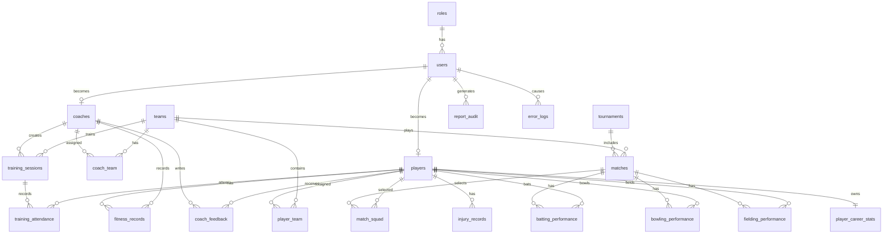

# ERD Description

## Entities

1. roles
2. users
3. coaches
4. players
5. teams
6. coach_team
7. player_team
8. tournaments
9. matches
10. match_squad
11. training_sessions
12. training_attendance
13. fitness_records
14. injury_records
15. batting_performance
16. bowling_performance
17. fielding_performance
18. coach_feedback
19. player_career_stats
20. report_audit
21. error_logs

## Main Relationships

- One role has many users.
- One user can be a coach or player.
- One coach can train many teams.
- One team can have many players.
- One coach creates many training sessions.
- One training session has many attendance records.
- One player has many fitness records.
- One player has many injury records.
- One match has many selected squad players.
- One match has many batting, bowling, and fielding performance records.
- One coach can give many feedback records to players.
- One player has one career stats record.

## Mermaid ERD

